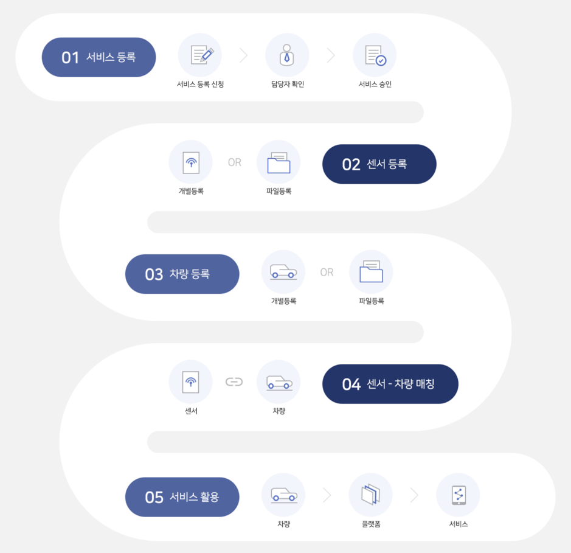

.. |br| raw:: html

    

서비스 세부 절차
=======================================

OVSE 플랫폼을 사용하려는 파트너들을 위한 매뉴얼입니다. 

전체 세부 절차
------------------

.. rst-class:: text-align-justify

OVSE 플랫폼을 이용하기 위한 절차는 다음과 같이 구성되어 있습니다.

<!--

-->
** 아래 절차로 그림 변경 필요 ** 

1. 포털 가입 및 인증키 발급 
 SK Open API 포털 계정 신청
 SK Open API 포털 계정 승인
 auth token 발급 
2. 회사(Company), 관리자(Director), 단말(Device) 등록 
 발급받은 token을 이용하여 API로 등록 
3. 서비스 활용
4. 통계

위 절차들은 `SK 오픈 API 포털에서 제공하는 `Open API <https://openapi.sk.com/>`__ 혹은 본 'OVSE 웹문서 <https://ovs-document.readthedocs.io/>`__ 에서 확인할 수 있습니다.

서비스 이용 안내
---------------------

.. rst-class:: text-align-justify

OVSE 플랫폼을 이용하는 개발자, 파트너사는 아래 절차를 참고하여 이용하실 수 있습니다.

OEM 및 Device 개발사
~~~~~~~~~~~~~~~~~~~~~~~~~~

1. 사업 문의

  .. rst-class:: text-align-justify

  SK Open API내 OVSE ‘Support/사업문의’ 메뉴를 통해서 OVSE 플랫폼 활용방안 문의 및 SKT OVSE 사업 담당자에게 연결됩니다. 

2. 회사 등록

  .. rst-class:: text-align-justify

  SK Open API 내 
  구체적인 사업 계획이 잡히고 SKT 담당자와의 협의가 완성되면 포털에서 서비스 등록을 신청합니다. 세부 절차는 :ref:`4.1. 서비스 등록 절차 <service-registration-portal>` 를 참고하시기 바랍니다.

3. 협력사 등록

  .. rst-class:: text-align-justify

  서비스 및 함께 사업을 할 협력회사를 등록합니다. 귀사로부터 귀사의 차량을 위임받을 수도 있고, 반대로 협력사의 차량을 위임받아서 귀사가 관리할 수 있습니다.
  세부 절차는 :ref:`4.2. 회사(협력사) 등록 절차 <company-registration-portal>` 를 참고하시기 바랍니다.

4. 단말(Device) 등록

  .. rst-class:: text-align-justify

  서비스 대상 단말을 등록합니다. 
  
5. 관리자(디렉터) 등록

  .. rst-class:: text-align-justify

  등록된 단말이 다수이어서 소수의 관리자가 관리하기 어려울 경우에는 복수의 디렉터를 할당할 수 있습니다. 세부 절차는 :ref:`4.5. 디렉터 등록 절차 <director-registration-portal>` 를 참고하시기 바랍니다.

App 개발자
~~~~~~~~~~~~~

.. rst-class:: text-align-justify

OVS 에서 제공하는 포털을 사용하지 않을 경우 고객사에서 자체적으로 App을 제작할 수 있습니다. 자체 App 개발을 진행하는 경우에는 OVS 플랫폼에서 제공하는 Open API를 활용하여 커넥티드카 서비스 App을 보다 쉽게 개발할 수 있습니다.

.. rst-class:: text-align-justify

1. 구성 요소 등록

  .. rst-class:: text-align-justify

  우선 OVS 구성 요소의 등록 방법은 :ref:`4. 구성요소(Entity) 등록 <entity-registration>` 절차를 통해서 자세하게 확인할 수 있습니다.

2. Open API

  .. rst-class:: text-align-justify

  OVS 플랫폼은 Restful Open API를 제공합니다. API를 통해 OVS 플랫폼에 데이터를 만들고 조회할 수 있습니다. Open API 규격에 대해서는 :ref:`6. API 규격 <api-specification>` 내용을 참고하시기 바랍니다.

3. 메시지 포맷

  .. rst-class:: text-align-justify

  차량에 부착된 센서들로부터 전송되는 자동차 운행과 관련된 정보의 메시지 포맷은 :ref:`6. 단말기 메시지 포맷 <message-format>` 내용을 참고하시기 바랍니다.

.. rst-class:: text-align-justify

Web App을 개발하는 개발자는 :ref:`7.2. Web Application Simulator <web-application-simulator>` 내용을 참고하시기 바랍니다.

|br|

.. _entity-procedure:
