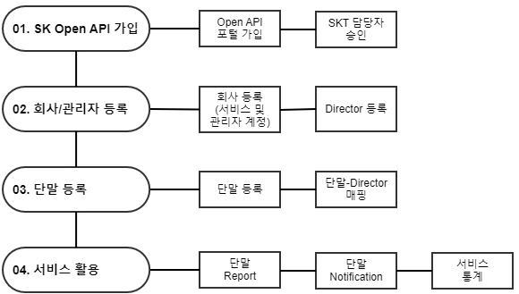
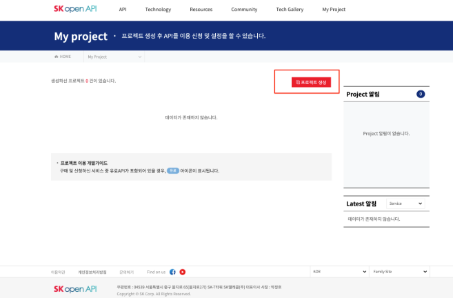
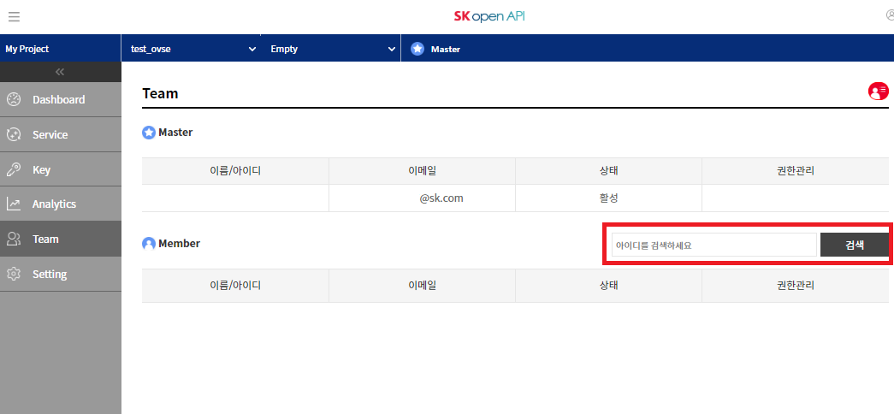

.. |br| raw:: html

    

.. _service-procedure:

서비스 세부 절차
=======================================

OVSE 플랫폼을 사용하려는 파트너들을 위한 매뉴얼입니다. 

.. _service-procedure-overview:

전체 절차
------------------

.. rst-class:: text-align-justify

OVSE 플랫폼을 이용하기 위한 절차는 다음과 같이 구성되어 있으며,
SK Open API 포털에서 제공하는 `OVSE API <https://openapi.sk.com/>`__ 혹은 본 `OVSE 웹문서 <https://ovs-document.readthedocs.io/>`__ 에서 확인할 수 있습니다.

.. _service-procedure-step1:

SK Open API 가입
---------------------
OVSE 플랫폼 및 API는 `SK Open API 포털 <https://openapi.sk.com/>`__ 가입후 이용할 수 있습니다. 
https://openapi.sk.com 접속 후 "회원가입" 메뉴를 통해 가입절차를 진행합니다. 

.. image:: images/skoa_1.png
	:width: 70%
	:align: center

.. _service-procedure-step2:

프로젝트 생성
---------------------
OVSE API 사용을 위해 SK Open API 포털내 "My Project" 메뉴에서 "프로젝트 생성" 하면 신규 프로젝트가 생성됩니다. 

생성된 프로젝트는 "My Project"의 "Dashboard" 메뉴에서 확인할 수 있으며, 
이후 "Service" 메뉴에서 OVSE API를 추가하면 해당 프로젝트에서 OVSE API를 사용할 수 있습니다. 

동일 프로젝트를 여러명의 사용자가 관리하는 경우 "My Project"의 "Team" 메뉴를 통하 멤버를 추가할 수 있습니다.

서비스 이용 안내
---------------------

.. rst-class:: text-align-justify

OVSE 플랫폼을 이용하는 개발자, 파트너사는 아래 절차를 참고하여 이용하실 수 있습니다.

OEM 및 Device 개발사
~~~~~~~~~~~~~~~~~~~~~~~~~~

1. 사업 문의

  .. rst-class:: text-align-justify

  SK Open API내 OVSE ‘Support/사업문의’ 메뉴를 통해서 OVSE 플랫폼 활용방안 문의 및 SKT OVSE 사업 담당자에게 연결됩니다. 

2. 서비스 및 회사 등록

  .. rst-class:: text-align-justify

  SK Open API포털에서 발급받은 계정으로 서비스 및 회사를 신청합니다. 세부 절차는 :ref:`5.1. 서비스 등록 절차 <service-registration-api>` 를 참고하시기 바랍니다.

3. 관리자(디렉터) 등록

  .. rst-class:: text-align-justify

  단말 관리를 위해 복수의 디렉터를 할당할 수 있습니다. 세부 절차는 :ref:`5.4. 디렉터 등록 절차 <director-registration-api>` 를 참고하시기 바랍니다.

4. 단말(Device) 등록

  .. rst-class:: text-align-justify

  서비스 대상 단말을 등록합니다. 
  

App 개발자
~~~~~~~~~~~~~

.. rst-class:: text-align-justify

OVSE 에서 제공하는 포털을 사용하지 않을 경우 고객사에서 자체적으로 App을 제작할 수 있습니다. 자체 App 개발을 진행하는 경우에는 OVS 플랫폼에서 제공하는 Open API를 활용하여 커넥티드카 서비스 App을 보다 쉽게 개발할 수 있습니다.

.. rst-class:: text-align-justify

1. 구성 요소 등록

  .. rst-class:: text-align-justify

  우선 OVSE 구성 요소의 등록 방법은 :ref:`5. 구성요소(Entity) 등록 <entity-registration>` 절차를 통해서 자세하게 확인할 수 있습니다.

2. Open API

  .. rst-class:: text-align-justify

  OVSE 플랫폼은 Restful Open API를 제공합니다. API를 통해 OVSE 플랫폼에 데이터를 만들고 조회할 수 있습니다. Open API 규격에 대해서는 :ref:`6. API 규격 <api-specification>` 내용을 참고하시기 바랍니다.

3. 메시지 포맷

  .. rst-class:: text-align-justify

  차량에 부착된 센서들로부터 전송되는 자동차 운행과 관련된 정보의 메시지 포맷은 :ref:`8. 메시지 포맷 <message-format>` 내용을 참고하시기 바랍니다.

.. rst-class:: text-align-justify

|br|

.. _entity-procedure:
