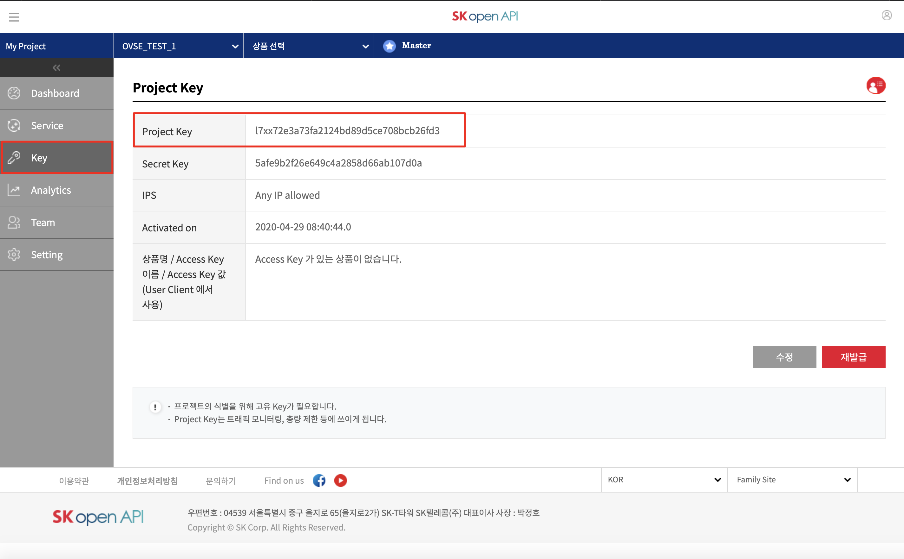

.. |br| raw:: html

    

.. _service-procedure:

서비스 세부 절차
=======================================

OVSE 플랫폼을 사용하려는 파트너들을 위한 매뉴얼입니다. 

.. _service-procedure-overview:

전체 절차
------------------

.. rst-class:: text-align-justify

OVSE 플랫폼을 이용하기 위한 절차는 다음과 같이 구성되어 있으며,
SK Open API 포털에서 제공하는 `OVSE API <https://openapi.sk.com/>`__ 혹은 본 `OVSE 웹문서 <https://ovs-document.readthedocs.io/>`__ 에서 확인할 수 있습니다.

.. image:: images/procedure_ovs4.png
	:width: 70%
	:align: center

.. _service-procedure-step1:

SK Open API 가입
---------------------
OVSE 플랫폼 및 API는 `SK Open API 포털 <https://openapi.sk.com/>`__ 가입후 이용할 수 있습니다. 
https://openapi.sk.com 접속 후 "회원가입" 메뉴를 통해 가입절차를 진행합니다. 

.. image:: images/skoa_1.png
	:width: 70%
	:align: center

.. _service-procedure-step2:

프로젝트 생성
---------------------
OVSE API 사용을 위해 SK Open API 포털내 "My Project" 메뉴에서 "프로젝트 생성" 하면 신규 프로젝트가 생성됩니다. 

.. image:: images/skoa_2.png
	:width: 70%
	:align: center

생성된 프로젝트는 "My Project"의 "Dashboard" 메뉴에서 확인할 수 있으며, 
이후 "Service" 메뉴에서 OVSE API를 추가하면 해당 프로젝트에서 OVSE API를 사용할 수 있습니다. 

동일 프로젝트를 여러명의 사용자가 관리하는 경우 "My Project"의 "Team" 메뉴에서 멤버를 추가할 수 있습니다.

.. image:: images/skoa_3.png
	:width: 70%
	:align: center

.. _service-procedure-step3:

토큰 조회
---------------------
OVSE API 호출시 인증을 위하여 유효한 token을 포함하여야 합니다. 
token은 "My Project"의 "Key" 메뉴에서 조회 가능합니다. 

token을 포함한 API 규격은 :ref:`7. API 규격 <api-specification>` 을 참고하십시오.

.. _service-procedure-step4:

단말 등록
---------------------
OVSE API가 포함된 프로젝트가 생성된 경우 API 호출 혹은 API 콘솔에서 단말 등록 가능합니다. 
단말등록은 단말ID(serialNo)와 단말credential(credentialsId)의 조합으로 이루어지며 회사코드(company prefix)가 앞부분에 포함되어 있어야 합니다. 
단말credential(credentialsId)은 5자리의 회사코드(company prefix)와 15자리의 개별암호로 이루어지며, 
단말ID(serialNo)는 길이의 제한은 없습니다. 

TBD: SK open API console을 통하여 등록하는 장면 캡쳐

+---------------+--------+-----------------------------------+--------------------------+
| Key           | Type   | Description                       | Example                  |
+===============+========+===================================+==========================+
| credentialsId | string | {company prefix}{unique no}       | abcde123456789012345     |
+---------------+--------+-----------------------------------+--------------------------+
| serialNo      | string | {company prefix}{device serialNo} | a1b2c3d4e5               |
+---------------+--------+-----------------------------------+--------------------------+

단말등록 API의 세부 필드는 :ref:`5.2 단말 등록 <device-registration>` 을 참조하세요. 
단말-OVSE플랫폼간 연동절차 및 프로토콜은 :ref:`6. Device 연동 절차 <device-procedure>` 를 참조하세요.

TBD: SK open API console을 통하여 등록하는 장면 캡쳐

.. _service-procedure-step5:

단말 통계 조회 
---------------------
OVSE플랫폼에 단말 등록 및 연동절차가 진행되었으면 OVSE 서비스를 받을 수 있으며, 단말별, 서비스별 통계를 조회할 수 있습니다. 

