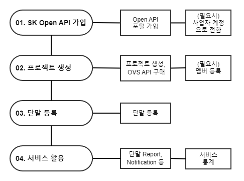
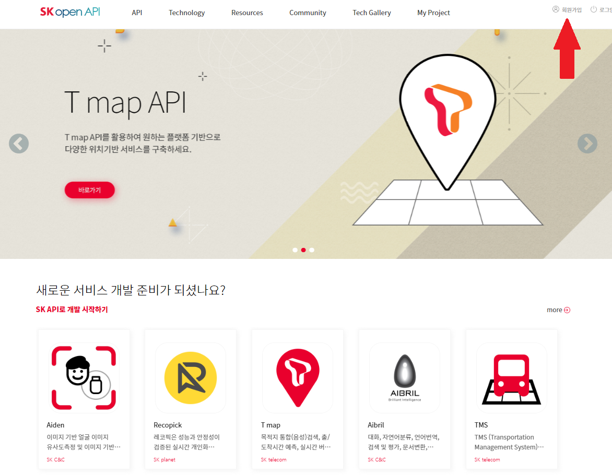
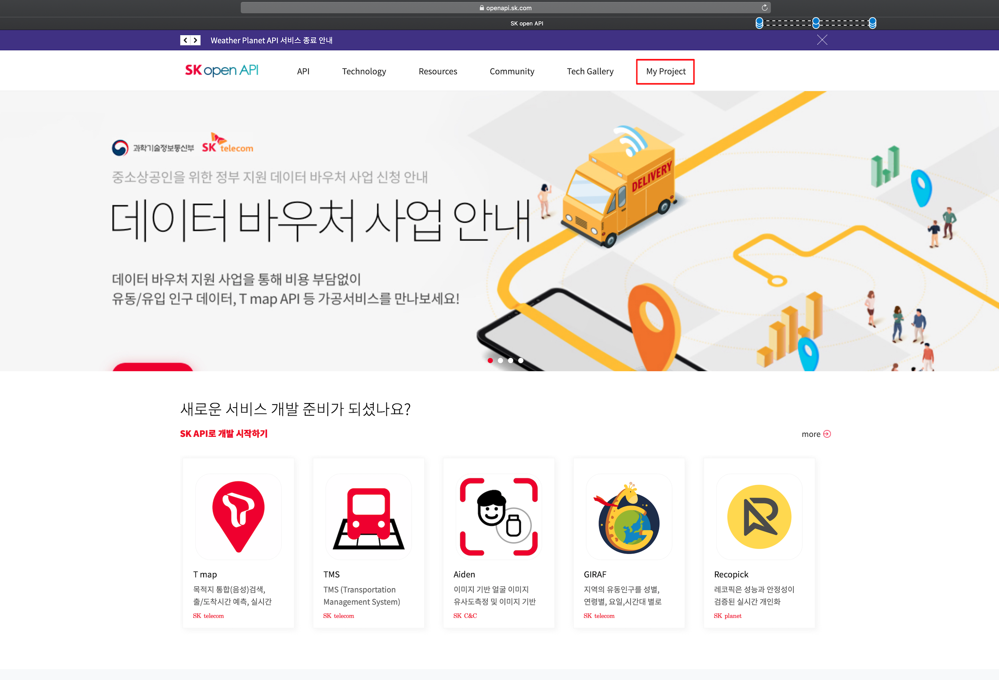
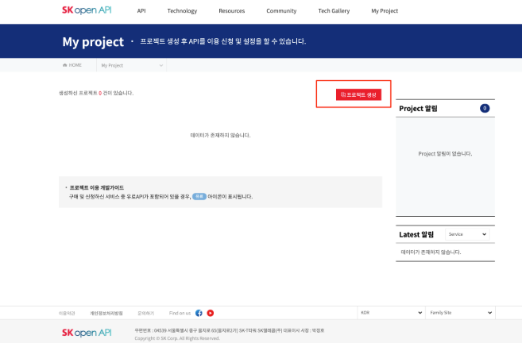
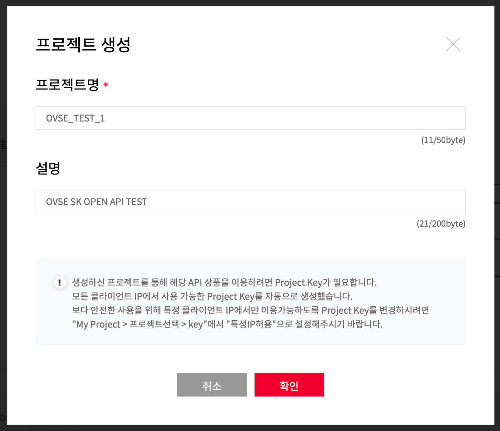
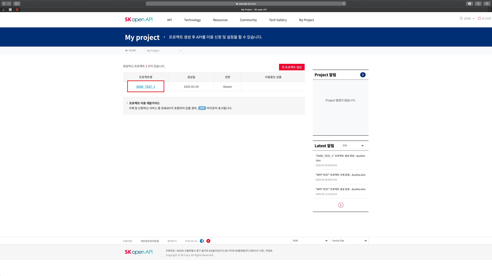
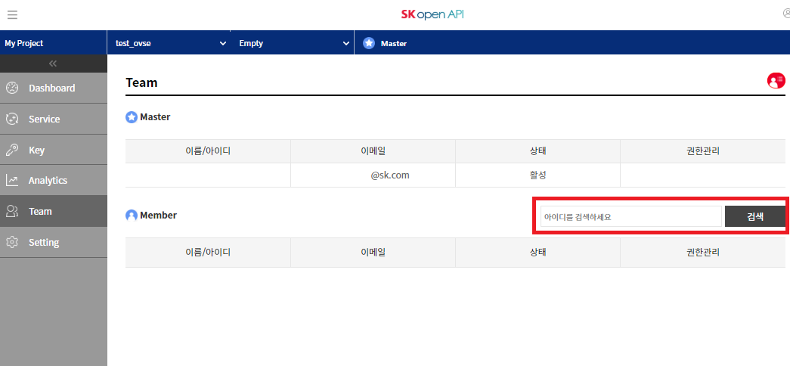
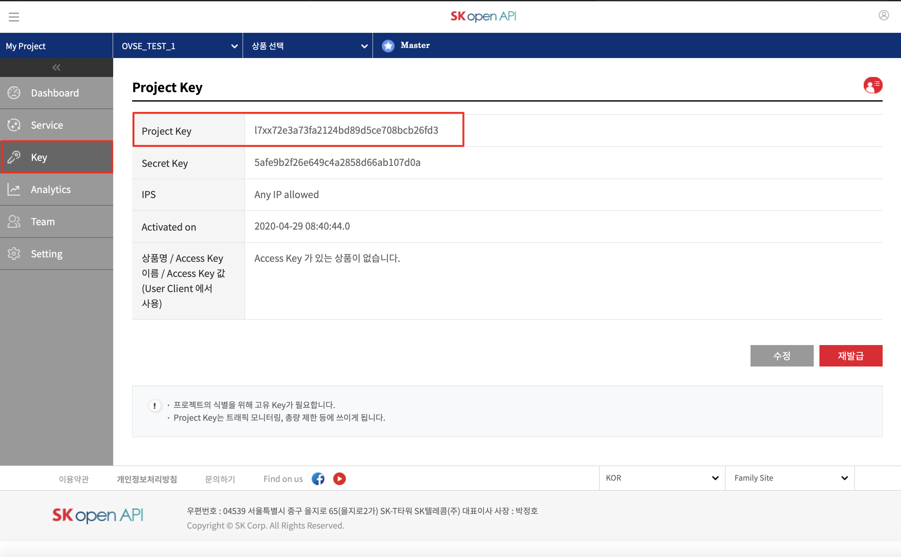

.. |br| raw:: html

    

.. _service-procedure-skoa:

Getting Started OVS (SK open API)
=======================================

OVS 플랫폼 서비스를 이용하시기 위해서는 SK open API 포털의 가입 및 OVS 서비스 구매가 필요합니다.

.. _service-procedure-overview:

OVS 플랫폼을 이용하기 위한 절차는 다음과 같이 구성되어 있습니다.

.. _service-procedure-step1:

SK open API 가입
---------------------
OVS 플랫폼 및 API는 `SK open API 포털 <https://openapi.sk.com/>`__ 가입후 이용할 수 있습니다. 

https://openapi.sk.com 접속 후 "회원가입" 메뉴를 통해 가입절차를 진행합니다. 

.. _service-procedure-step2:

프로젝트 생성
---------------------
OVS API 사용을 위해 SK open API 포털내 "My Project" 메뉴에서 "프로젝트 생성"을 하면 신규 프로젝트가 생성됩니다. 

생성된 프로젝트는 "My Project"의 "Dashboard" 메뉴에서 확인할 수 있으며, 

이후 "Service" 메뉴에서 OVS API를 추가하면 해당 프로젝트에서 OVS API를 사용할 수 있습니다. 

동일 프로젝트를 여러명의 사용자가 관리하는 경우 "My Project"의 "Team" 메뉴에서 멤버를 추가할 수 있습니다.

.. _service-procedure-step3:

토큰 조회
---------------------
OVS API 호출시 인증을 위하여 유효한 auth token을 포함하여야 하며, 다음 두 가지 token이 필요합니다.

SK open API 접근을 위한 auth token
......................................
프로젝트를 생성하면, My Project의 Key 탭의 Project Key에서 확인가능합니다.

이후 API의 parameter로 app key 입력이 필요합니다. 

OVS API 접근을 위한 auth token: 
.....................................
OVS 서비스 가입 후, Company 정보 조회 API를 이용하여 확인하실 수 있습니다. 

가입 및 서비스 생성 직후에는 Company Id를 알 수 없으니, 내 회사 정보 조회 (company/me) API를 사용하시면 됩니다. 

auth token을 포함한 API 규격은 :ref:`7. API 규격 <api-specification>` 을 참고하십시오.

.. _service-procedure-step4:

단말 등록
---------------------
OVS API가 포함된 프로젝트가 생성된 경우 API 호출 혹은 API 콘솔에서 단말 등록 가능합니다. 

단말등록은 단말 ID(serialNo)와 단말 credential(credentialsId)의 조합으로 이루어지며 회사코드(company prefix)가 앞부분에 포함되어 있어야 합니다. 

단말 credential(credentialsId)은 5자리의 회사코드(company prefix)와 15자리의 개별암호로 이루어지며, 
단말 ID(serialNo)는 길이의 제한은 없습니다. 

(TBD: SK open API console을 통하여 등록하는 장면 캡쳐)

+---------------+--------+-----------------------------------+--------------------------+
| Key           | Type   | Description                       | Example                  |
+===============+========+===================================+==========================+
| credentialsId | string | {company prefix}{unique no}       | csx13123451234500001     |
+---------------+--------+-----------------------------------+--------------------------+
| serialNo      | string | {company prefix}{device serialNo} | csx13123451234500001     |
+---------------+--------+-----------------------------------+--------------------------+

단말등록 API의 세부 필드는 :ref:`5.2 단말 등록 <device-registration>` 을 참조하시기 바랍니다.  

단말-OVS플랫폼간 연동절차 및 프로토콜은 :ref:`6. Device 연동 절차 <device-procedure>` 를 참조하시기 바랍니다. 

TBD: SK open API console을 통하여 등록하는 장면 캡쳐(현재 화면없음)

다음은 지금까지의 과정을 통해 얻어진 계정 및 단말 정보의 샘플입니다.

+--------------+-----------------------------+-------------------------------------------------------------------+
| Key          | Description                 | 샘플값                                                            |
+==============+=============================+===================================================================+
| API token    | OVS API 호출을 위한 token   | eyJhbGciOiJIUzUxMiJ9.eyJzdWIiOiJ0ZXN0Y29tcGFueTFAc2tvcGVuYXBpLm   |
|              |                             | NvbSIsInNjb3BlcyI6WyJPVlNfQ09NUEFOWV9BRE1JTiJdLCJ1c2VySWQiOiJlN   |
|              |                             | zQ0MzU5MC1iNWQ1LTExZWEtOGYwMC02NzMwZThlZjFhOWUiLCJlbmFibGVkIjp0   |
|              |                             | cnVlLCJpc1B1YmxpYyI6ZmFsc2UsInRlbmFudElkIjoiZTczZDdlZDAtYjVkNS0   |
|              |                             | xMWVhLThmMDAtNjczMGU4ZWYxYTllIiwiY3VzdG9tZXJJZCI6IjEzODE0MDAwLT   |
|              |                             | FkZDItMTFiMi04MDgwLTgwODA4MDgwODA4MCIsInNlcnZpY2VUeXBlIjoic2tvY   |
|              |                             | V90ZXN0Y29tcGFueTEiLCJpc3MiOiJUIFJlbW90RXllLlNLIFRlbGVjb20iLCJp   |
|              |                             | YXQiOjE1OTI5NzQwOTAsImV4cCI6NDEwMjMyNjAwMH0.15p2NCfzAe41BleJhiM   |
|              |                             | gPJKenM3wPbdk7MY3ohatGNRG8J3pZUSaILfXuAta62UsoBKFMDn7J0I3cjzo1e   |
|              |                             | pfgg                                                              |
+--------------+-----------------------------+-------------------------------------------------------------------+
| username     | 단말 serialNo               | csx13123451234500001,                                             |
|              |                             | csx13123451234500002                                              |
+--------------+-----------------------------+-------------------------------------------------------------------+
| password     | 단말 credentialsId          | csx13123451234500001,                                             |
|              |                             | csx13123451234500002                                              |
+--------------+-----------------------------+-------------------------------------------------------------------+
| companyId    | 회사 ID                     | e73d7ed0-b5d5-11ea-8f00-6730e8ef1a9e                              |
+--------------+-----------------------------+-------------------------------------------------------------------+
| deviceType   | 디바이스 타입               | OVC-G                                                             | 
+--------------+-----------------------------+-------------------------------------------------------------------+

.. _service-procedure_step5:

Device Simulator 사용
-----------------------------------
등록된 단말의 동작 및 메세지 송/수신을 확인하는 시험을 간단히 진행하실 수 있도록, 디바이스의 역할을 대행하는 테스트용 OVS Device Simulator를 제공합니다.

OVS Device Simulator의 자세한 동작은 :ref:`9. Device Simulator<device-simulator>` 를 참고하시기 바랍니다. 

.. _service-procedure-step6:

서비스 통계 조회 
---------------------
OVS플랫폼에 단말 등록 및 연동절차가 진행되었으면 OVS 서비스를 이용하실 수 있으며, 단말별, 회사별 통계를 조회할 수 있습니다. 

통계 조회 API는 :ref: `6.5. 이벤트 통계 API <api-specification-statistics>` 를 참조하시기 바랍니다. 

